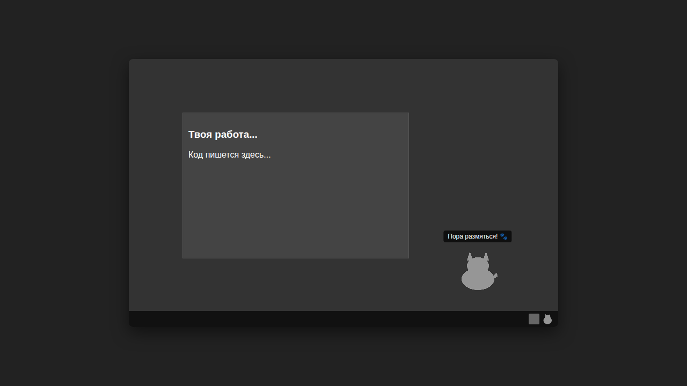

# 🐾 Десктопный Котик (Desktop Pet Cat)



[English version below](#english-version)

## 🇷🇺 Описание проекта

**Десктопный Котик** — это интерактивный виртуальный питомец для Windows, вдохновленный проектом comnyang.com. Он живет на вашем рабочем столе, следует за курсором, реагирует на печать и помогает оставаться продуктивным, напоминая о перерывах.

### ✨ Основные функции
- **Всегда поверх (Always-on-top)**: Котик никогда не теряется за открытыми окнами.
- **Прозрачное окно**: Безрамочный интерфейс, который идеально вписывается в рабочий стол.
- **Mochi Drag**: Уникальный эффект растягивания питомца при перетаскивании мышью.
- **Реакция на клавиатуру**: Котик начинает «работать», когда вы активно печатаете.
- **Системный трей**: Удобное меню для кормления, игр и настройки питомца.
- **Таймеры продуктивности**:
  - **Pomodoro**: Настраиваемые циклы работы и отдыха.
  - **Напоминание о растяжке**: Уведомления каждые 30 минут, чтобы вы не забывали двигаться.
- **Локальное хранение**: Все настройки (`settings.json`) и история активности (`activity.db`) хранятся только на вашем компьютере.
- **Полный Offline**: Приложение не требует интернета и не передает данные.

### 🛠 Установка и запуск
1. Убедитесь, что у вас установлен Python 3.10+.
2. Установите зависимости:
   ```bash
   pip install -r requirements.txt
   ```
3. Запустите приложение:
   ```bash
   python main.py
   ```

---

## 🇺🇸 English Version

**Desktop Pet Cat** is an interactive virtual companion for Windows, inspired by comnyang.com. It lives on your desktop, reacts to your keystrokes, and helps you stay productive by reminding you to take breaks.

### ✨ Key Features
- **Always-on-top**: The pet is always visible over other windows.
- **Transparent Window**: A frameless UI that blends perfectly with your workspace.
- **Mochi Drag**: A unique stretching effect when dragging the pet with your mouse.
- **Input Reaction**: The pet enters "working" mode when you start typing.
- **System Tray**: A convenient menu for feeding, playing, and managing settings.
- **Productivity Timers**:
  - **Pomodoro**: Customizable work and break cycles.
  - **Stretch Reminder**: Notifications every 30 minutes to keep you moving.
- **Local Storage**: All settings (`settings.json`) and activity logs (`activity.db`) are stored locally on your machine.
- **Fully Offline**: No internet connection required; your data stays private.

### 🛠 Installation and Quick Start
1. Ensure you have Python 3.10+ installed.
2. Install dependencies:
   ```bash
   pip install -r requirements.txt
   ```
3. Run the application:
   ```bash
   python main.py
   ```

---
*Создано с любовью для продуктивных кошатников.*
